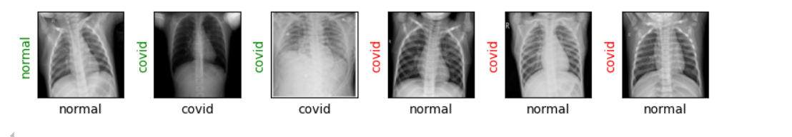

# Detecting COVID-19 with Chest X Ray using PyTorch
Early and accurate diagnosis of COVID-19 is crucial to contain its spread and initiate timely treatment. The standard diagnostic methods such as nasal and throat swabs (RT-PCR tests) often suffer from low sensitivity and delayed results, leading to false negatives and uncontrolled transmission. This project demonstrates a basic image classification pipeline using PyTorch and torchvision.  
pre trained prediction:

## Evaluation Metric
A CNN model is trained on a custom dataset and evaluated using accuracy and a confusion matrix.

## Results
### Sample Prediction
Visualizes a prediction made by the trained model on test data.

### Confusion Matrix
Displays how well the model performed across all classes.

### Performance Metrics  
- **Accuracy**: 95.51%  
- **Loss**: 0.113
 
